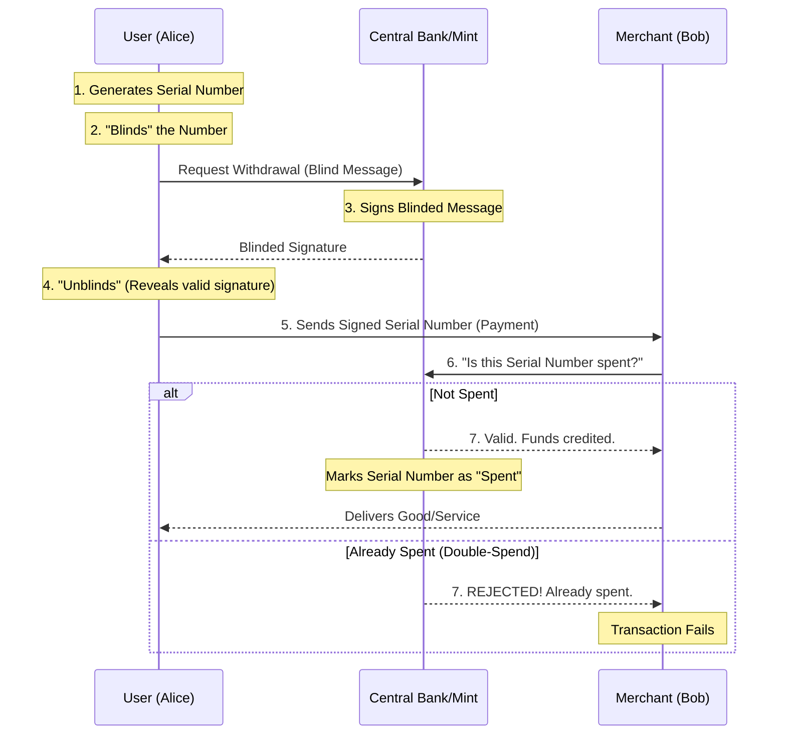

# E-Cash Flow and Double-Spending Diagram

## The Centralized E-Cash Flow (Chaumian)
This diagram illustrates how digital cash worked before Bitcoin, highlighting the role of the central mint and the blind signature process.

## Transition to Bitcoin
The primary difference is that in Bitcoin, the **"Bank/Mint"** is replaced by a **Decentralized Network of Nodes** and the **Blockchain**.

---
#diagram #bitcoin #ecash
